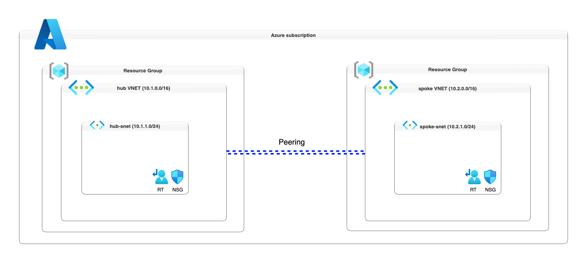

# ☁️ Azure Networking Stack (Terraform Module)

The **Azure Networking Stack** is a modular, production-ready Terraform configuration designed to provision and manage core networking infrastructure in Microsoft Azure. It supports a range of networking components including virtual networks, subnets, route tables, network security groups (NSGs), and virtual network peerings. Each component is implemented as a reusable child module, enabling scalable and consistent deployments across environments. This stack is ideal for teams looking to automate Azure network provisioning with flexibility, compliance, and clarity.

---

## 🚀 What Does It Deploy?

| Component                         | Description                                                                 |
|----------------------------------|-----------------------------------------------------------------------------|
| 🔷 Virtual Network               | Configurable VNet with DNS, address space, edge zone, diagnostics, etc.     |
| 🔶 Subnets                      | Custom subnets with service endpoints, delegation, and policy controls      |
| 🚦 Route Tables                 | Custom routes, BGP propagation, and subnet association                      |
| 🔐 Network Security Groups (NSGs) | Inbound/outbound rules, metrics, logs, and per-subnet NSG assignment        |     |

---

## 🛠️ Implementation Notes
- Uses CloudAstro Terraform modules for core infrastructure.
- Tags for Subnets are not supported yet.
- Diagnostic settings are supported across all components.

## 🗺️ Azure Networking Stack Architecture Diagram (Peering Connection Setup)

This diagram illustrates a modular Terraform design for provisioning multiple Azure Virtual Networks (VNets) with VNet peering. Each VNet includes its own subnets, with optional NSGs and Route Tables. The architecture highlights how modules are composed to enable flexible, scalable network topologies and how peerings are established between VNets for secure interconnectivity.

## Example Usage

This example demonstrates how to provision subnets including route tables and default network security group within a virtual network, each with its specific configurations and optional delegations.